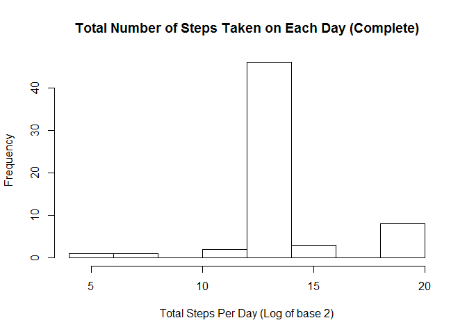

Activity Monitoring Analysis
----------------------------

    # Download and Load the data
    fpath <- "C:/c5proj1/"
      setwd(fpath)
      fname <- "activity.csv"
      zipfile<- "activity.zip"
      file_url <- "https://d396qusza40orc.cloudfront.net/repdata%2Fdata%2Factivity.zip"
        if (!file.exists(fname)){
      download.file(fileurl,zipfile)
      unzip(zipfile = zipfilename)
      }
    activity_data_full <- read.csv("activity.csv", header = TRUE)
    activity_data <- na.omit(activity_data_full)

Total number of steps taken in a day
====================================

    tot_step_dt <- tapply(activity_data$steps, activity_data$date ,sum , na.rm=TRUE)
    hist (tot_step_dt,  xlab="Total Steps Per Day" , main="Total Number of Steps Taken on Each Day")

    #Mean of the total number of steps taken per day
    mean(tot_step_dt, na.rm=TRUE)

    ## [1] 10766.19

    #Median of the total number of steps taken per day
    median(tot_step_dt, na.rm=TRUE)

    ## [1] 10765

Average steps taken in 5 Min intervals
======================================

    avg_stp_5min <- tapply(activity_data$steps, activity_data$interval ,mean , na.rm=TRUE)
    plot (unique(activity_data$interval), avg_stp_5min,type="l", xlab="Interval" , ylab="Avg.Steps") 

    #Max of the 5-Min Interval
    avg_stp_5min[which.max(avg_stp_5min)]

    ##      835 
    ## 206.1698

    ## 
    ## Attaching package: 'dplyr'

    ## The following objects are masked from 'package:stats':
    ## 
    ##     filter, lag

    ## The following objects are masked from 'package:base':
    ## 
    ##     intersect, setdiff, setequal, union

Input the missing values
========================

    #Total Number of rows with missing values
    sum(is.na(activity_data_full))

    ## [1] 2304

    #Fill the NA in the original data set with values 
    activity_comp <- activity_data_full %>% mutate( steps = if_else(is.na(steps), mean(interval,na.rm=T),as.numeric(steps)))

Total number of steps taken in a day with complete data set
===========================================================

    tot_step_dt1 <- tapply(activity_comp$steps, activity_comp$date ,sum , na.rm=TRUE)
    hist (log(tot_step_dt1, base=2),  xlab="Total Steps Per Day (Log of base 2)" , main="Total Number of Steps Taken on Each Day (Complete)")

    #Mean of the total number of steps taken per day
    mean(tot_step_dt1, na.rm=TRUE)

    ## [1] 53828.98

    #Median of the total number of steps taken per day
    median(tot_step_dt1, na.rm=TRUE)

    ## [1] 11458

Differences in activity patterns between weekdays and weekends
==============================================================

    activity_comp$wday <-weekdays.Date(as.Date(activity_comp$date))
    activity_wd <- activity_comp  %>% mutate( wday = if_else( (wday == "Saturday" | wday == "Sunday") , "Weekend", "Weekday")) 
    #Average steps across all week day
    week_day_data <- subset(activity_wd , activity_wd$wday %in% "Weekday")
    week_end_data <- subset(activity_wd , activity_wd$wday %in% "Weekend")
    tot_step_wd <- tapply(week_day_data$steps, week_day_data$interval ,mean , na.rm=TRUE)
    tot_step_we <- tapply(week_end_data$steps, week_end_data$interval ,mean , na.rm=TRUE)
    par(mfrow= c(1,2))
    plot (unique(week_day_data$interval), tot_step_wd,type="l", xlab="Interval" , ylab="Avg.Steps" , main = "Weekday Avg. Steps") 
    plot (unique(week_end_data$interval), tot_step_we,type="l", xlab="Interval" , ylab="Avg.Steps",   main = "Weekend Avg. Steps") 

